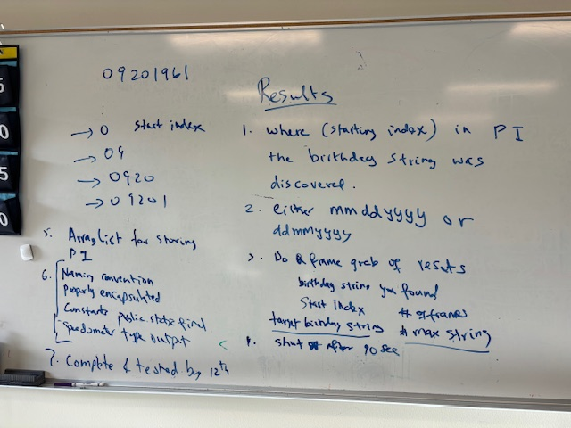

# PIDay - A special project to celebrate Pi Day!

### Overview
In this project we will ***find a given birthday pattern in PI*** which is read in from a file containing several million digits of PI.  We will use   We will attempt to find the birthday string in either the "british" ```01/21/1995``` or "us" ```21/01/1995``` (ignoring the forward-slashes standard for date strings). 

### References

[Download 1-million Digits of PI as a text file](pi-million.txt)
[Download 10-million Digits of PI as a text file](pi-tenmillion.txt)
[Link to download 1-billion Digits of PI as a text file](https://stuff.mit.edu/afs/sipb/contrib/pi/)

### Specifications



### Tasks
1. Fork this repository to your Github account. After you develop, test and create the final version of your Java code, you can simply all of your ```*.pde``` files into this Github repository.  This will be your final submission for this project.
1. Create a class ```MyPI``` that contains the ```public static final String [] PI```. Strictly follow this naming convention specified. 
1. We will use the Processing function ```loadStrings()```.  This function should read the file ```pi-million.txt``` referenced above and return a String []. This array will now contain 1 million Strings, each of length 1 containing a single digit.
1. We will then write a method getNextTenDigits() in the MyPI class which uses a for-loop to extract and return the ```next``` 10 digits of PI at a time as a single String variable by using += operator (fastest and easy). You may have to detect and ignore the ```decimal-point``` if it exists in the file.
1. Note that you have to create, update and use a ```static int nextIndex``` variable inside the MyPI Class to know which next digits you need to return as a String. You will also need to account for the end of the String [] PI to not try and access beyond it.
1. Obtain user input for birthday string by using the processing keyTyped() function in the main tab. Identify the end of input when user types in the # charracter. Store this in a variable that can be used to fing the birthday string in digits of PI. 
Write a method to detect increasing piece lengths of the birthday string and print the start location of where it was found or the fact that it was not found.
1. Display results in the console.
